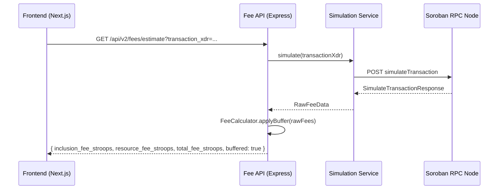
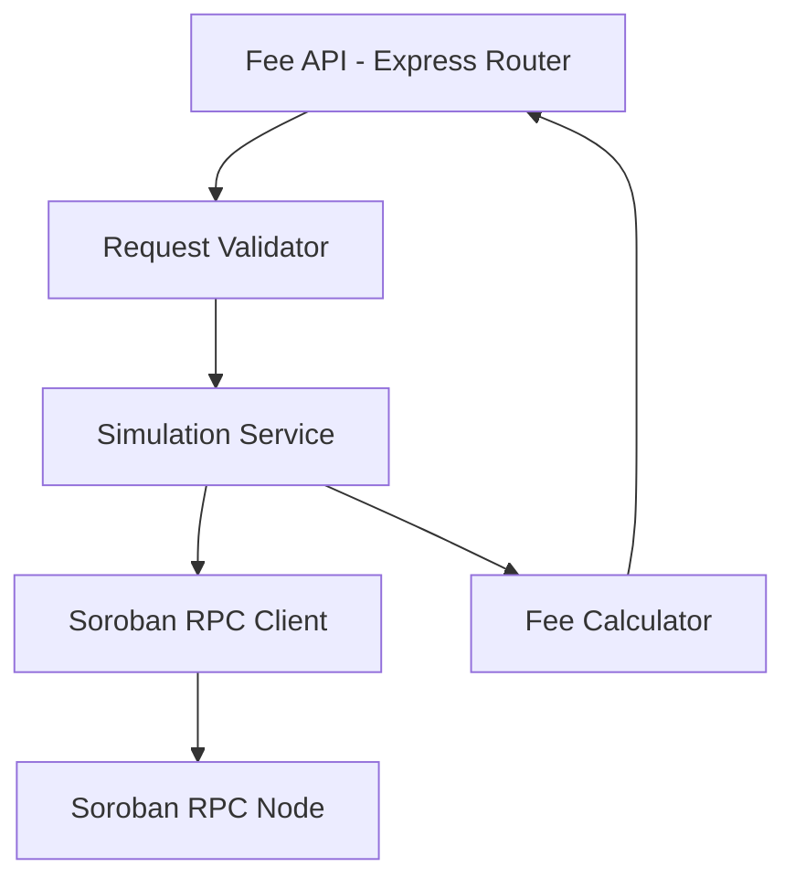

# Design Document: Gas-Estimate Oracle

## Overview

The Gas-Estimate Oracle is a lightweight Node.js/TypeScript backend service that sits between the Nebula V2 frontend and the Stellar Soroban RPC node. When the frontend needs to show a user the cost of an operation before they sign, it calls `GET /api/v2/fees/estimate?transaction_xdr=<base64-xdr>`. The service simulates the transaction against the Soroban RPC, extracts the inclusion fee and resource fee, applies a 10% safety buffer to the resource fee, and returns the breakdown as JSON.

The service is intentionally minimal: no database, no authentication, stateless. It is deployed as a standalone HTTP server alongside the existing Next.js frontend.

## Architecture





## Components and Interfaces

### Fee API (Express Router)

Entry point. Validates the incoming request, delegates to the Simulation Service, and formats the response.

```typescript
// GET /api/v2/fees/estimate
// Query params: transaction_xdr (required, base64 XDR string)
// Response: FeeEstimateResponse | ErrorResponse
```

### Simulation Service

Wraps the Soroban RPC `simulateTransaction` JSON-RPC call.

```typescript
interface SimulationService {
  simulate(transactionXdr: string): Promise<RawFeeData>;
}

interface RawFeeData {
  minResourceFee: number; // stroops, from RPC response
  inclusionFee: number;   // stroops, base fee from transaction
}
```

The Soroban RPC `simulateTransaction` response shape (relevant fields):

```json
{
  "result": {
    "minResourceFee": "12345",
    "cost": {
      "cpuInsns": "1000000",
      "memBytes": "50000"
    }
  }
}
```

`minResourceFee` is the resource fee increment. The inclusion fee is derived from the transaction's `fee` field in the XDR envelope.

### Fee Calculator

Pure functions — no side effects, easy to test.

```typescript
interface FeeCalculator {
  applyBuffer(raw: RawFeeData): BufferedFees;
}

interface BufferedFees {
  inclusionFeeStroops: number;
  resourceFeeStroops: number; // ceil(minResourceFee * 1.10)
  totalFeeStroops: number;    // inclusionFeeStroops + resourceFeeStroops
}
```

### API Response Types

```typescript
interface FeeEstimateResponse {
  inclusion_fee_stroops: number;
  resource_fee_stroops: number;
  total_fee_stroops: number;
  buffered: true;
}

interface ErrorResponse {
  error: string;
  message: string;
}
```

## Data Models

### Environment Configuration

| Variable | Required | Default | Description |
|---|---|---|---|
| `SOROBAN_RPC_URL` | Yes | — | Full URL of the Soroban RPC node |
| `PORT` | No | `3001` | HTTP listen port |
| `CORS_ORIGIN` | No | `*` | Allowed CORS origin |

### Fee Calculation Model

```
buffered_resource_fee = ceil(minResourceFee * 1.10)
total_fee = inclusionFee + buffered_resource_fee
```

All values are non-negative integers in stroops. The inclusion fee is extracted from the XDR transaction envelope's `fee` field. The resource fee comes from the RPC simulation result's `minResourceFee` field.

## Correctness Properties

*A property is a characteristic or behavior that should hold true across all valid executions of a system — essentially, a formal statement about what the system should do. Properties serve as the bridge between human-readable specifications and machine-verifiable correctness guarantees.*

Property 1: Safety buffer is always at least 10%
*For any* non-negative raw resource fee, the buffered resource fee produced by Fee_Calculator SHALL be greater than or equal to `ceil(raw * 1.10)`.
**Validates: Requirements 2.1, 2.2**

Property 2: Zero resource fee stays zero
*For any* simulation result where `minResourceFee` is zero, the buffered resource fee SHALL be zero.
**Validates: Requirements 2.3**

Property 3: Inclusion fee is preserved unchanged
*For any* raw fee data, the `inclusionFeeStroops` in the buffered output SHALL equal the `inclusionFee` in the raw input.
**Validates: Requirements 2.4**

Property 4: Total fee is the sum of its parts
*For any* buffered fee result, `totalFeeStroops` SHALL equal `inclusionFeeStroops + resourceFeeStroops`.
**Validates: Requirements 2.5**

Property 5: All fee values are non-negative integers
*For any* valid simulation result, all three fee fields in the API response SHALL be non-negative integers.
**Validates: Requirements 3.7**

Property 6: Buffer is idempotent on zero
*For any* call to `applyBuffer` with `minResourceFee = 0`, calling it again on the result SHALL produce the same output.
**Validates: Requirements 2.3**

## Error Handling

| Scenario | HTTP Status | Error Field |
|---|---|---|
| Missing `transaction_xdr` param | 400 | `"missing_parameter"` |
| Malformed XDR string | 422 | `"invalid_xdr"` |
| Soroban RPC simulation error | 502 | `"simulation_failed"` |
| RPC node unreachable / timeout | 502 | `"rpc_unreachable"` |
| Unhandled exception | 500 | `"internal_error"` |

All error responses follow the `ErrorResponse` shape: `{ error: string, message: string }`.

The service does not retry failed RPC calls — retries are the caller's responsibility. The 10-second RPC timeout (Requirement 1.4) is enforced via an `AbortController` on the fetch call.

## Testing Strategy

### Dual Testing Approach

Both unit tests and property-based tests are used. Unit tests cover specific examples, edge cases, and integration points. Property tests verify universal correctness of the Fee Calculator across all numeric inputs.

### Property-Based Testing

Library: **fast-check** (TypeScript)

Each property test runs a minimum of 100 iterations.

- **Property 1 test**: Generate arbitrary non-negative integers for `minResourceFee`, assert `buffered >= ceil(raw * 1.10)`.
- **Property 2 test**: Input `minResourceFee = 0`, assert output is `0`. (edge-case, included in generator range)
- **Property 3 test**: Generate arbitrary `inclusionFee` values, assert output `inclusionFeeStroops === input inclusionFee`.
- **Property 4 test**: Generate arbitrary `RawFeeData`, assert `total === inclusion + resource`.
- **Property 5 test**: Generate arbitrary valid simulation responses, assert all response fields are non-negative integers.

Tag format: `Feature: gas-estimate-oracle, Property N: <property_text>`

### Unit Tests

- Simulation Service: mock the RPC HTTP call, assert correct field extraction from a known response fixture.
- Fee API: use `supertest` to test each HTTP status code path (400, 422, 502, 500, 200).
- Health endpoint: assert `GET /health` returns `200 { status: "ok" }`.
- Configuration: assert service exits with non-zero code when `SOROBAN_RPC_URL` is unset.

### Test File Layout

```
backend/
  src/
    simulation-service.ts
    fee-calculator.ts
    api.ts
    config.ts
  tests/
    fee-calculator.test.ts       # unit + property tests
    simulation-service.test.ts   # unit tests with mocked RPC
    api.test.ts                  # integration tests via supertest
```
